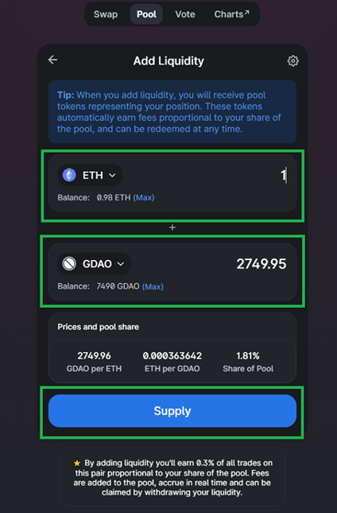

# Creating LP & stake in Geyser Fountain Pool


\
**Summary**

Following assists with creating LP \[Liquidity Provider] for staking in Geyser or on Uniswap.

**Prerequisites**

·         ETH

·         GDAO

·         ETH for conversion and staking

**How Uniswap Liquidity Pool works**

We will go further to explain how the Uniswap Liquidity pool works. The liquidity pools are an aggregation of tokens in smart contracts. There are many ERC-20 tokens in this liquidity pool for you to exchange – swap, send, and Pool- with another person, With Ethereum being the conduit. So, you can create a new exchange pair in a new liquidity pool for any token of your choice.

For example, you can be part of the ETH/GDAO liquidity pool. You will need to make an equal value of Ethereum and GDAO, which is the token that you want to participate with. Therefore when someone comes in and decides to trade ETH/GDAO on Uniswap, your liquidity will be taped.

If someone wants to trade Ethereum in exchange for GDAO, your GDAO liquidity might reduce while Ethereum liquidity goes up. If your GDAO goes down by a dollar, your Ethereum will go up by a dollar also. This is the way that the Uniswap Liquidity Pool work.

To provide LP one must contribute an equal split of two tokens 50/50 of each to form the LP.

**Create LP instructions**

1\.       Following link will position you to add 50 % of each

[https://app.uniswap.org/#/add/ETH/0x515d7E9D75E2b76DB60F8a051Cd890eBa23286Bc/3000](https://app.uniswap.org/#/add/ETH/0x515d7E9D75E2b76DB60F8a051Cd890eBa23286Bc/3000)

2\.       Confirm the following as per screenshot

\-          Deposit Amount will be the contributed, by adding for example 1 ETH the required other half of GDAO will be displayed, then click ‘Supply’

3\.       A prompt to ‘approve’ and ‘convert’ will be required.

4\.       Once completed UNI-V2 tokens will be in your wallet.

5\.       If you add the following address to your wallet the LP tokens will display 0x4d184bf6f805ee839517164d301f0c4e5d25c374

.png>)

**To stake LP into Geyser**

Gysr fountain pool

[https://app.gysr.io/pool/0x9b1602f4d05d78909a0c0675150dfc5bdee7fdec](https://app.gysr.io/pool/0x9b1602f4d05d78909a0c0675150dfc5bdee7fdec)

Purchase GYSR option

If you choose to purchase GYSR this will push up your rewards based on the GYSR holding. Before purchasing any GYSR there is the option to understand the potential rewards would be based on your GYSR tokens.

**Important to note** that if you choose to purchase GYSR to gain the rewards the GYSR tokens will be burnt on entry which will secure your rewards but will not gain those GYSR tokens on exit.

.png>)

Following link to purchase GYSR if required.

[https://app.uniswap.org/#/swap?outputCurrency=0xbea98c05eeae2f3bc8c3565db7551eb738c8ccab\&inputCurrency=ETH\&use=V2](https://app.uniswap.org/#/swap?outputCurrency=0xbea98c05eeae2f3bc8c3565db7551eb738c8ccab\&inputCurrency=ETH\&use=V2)

To Stake UNI-V2 GYSR

&#x20;   \-> Click on ‘Max’ to select your available UNI-V2

&#x20;    \->  Click ‘Stake’   &#x20;

&#x20;    \-> Approve UNI-V2

&#x20;   \-> Approve GYSR (optional)

&#x20;   \-> Stake them

## Impermanent Loss Calculator

[https://dailydefi.org/tools/impermanent-loss-calculator/](https://dailydefi.org/tools/impermanent-loss-calculator/)
