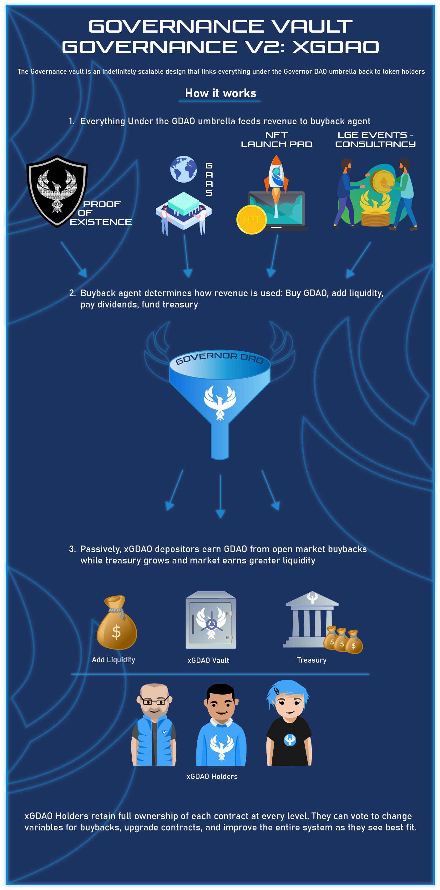

# Governance Vault User Guide

### **Executive Summary**

The following outlines the Governance Vault, as well as an overview of the contracts comprising the initial vault rollout and how the community can test and prepare these contracts for mainnet usage**.**

Vault site: [https://vault.governordao.org/](http://vault.governordao.org/)

### **Contract Addresses (Mainnet)**

| Contract                        | Address                                                                                                               |
| ------------------------------- | --------------------------------------------------------------------------------------------------------------------- |
| GDAO Token                      | [0x515d7e9d75e2b76db60f8a051cd890eba23286bc](https://etherscan.io/address/0x515d7e9d75e2b76db60f8a051cd890eba23286bc) |
| xGDAO Governance Vault          | [0x306978da6ebee060375f35418744f85c1cb6b353](governance-vault-user-guide.md#executive-summary)                        |
| Buyback Agent                   | [0x7f651fa68337208ed54e92dde8a52c5d8b629a5c](governance-vault-user-guide.md#executive-summary)                        |
| POE                             | [0x5945baf9272e0808165adea61b932ec1604fb161](governance-vault-user-guide.md#okay-so-what-does-this-mean-for-me)       |
| POE Purchase "Payment Splitter" | TBD                                                                                                                   |
| FinnoSplitter (Auxiliary)       | TBD                                                                                                                   |
| Uniswap GDAO-ETH V2             | [0x4d184bf6f805ee839517164d301f0c4e5d25c374](https://etherscan.io/address/0x4d184bf6f805ee839517164d301f0c4e5d25c374) |

### **Governance Vault Importance/Intentions**

Creating a working DAO is a challenging endeavor with numerous interactive parts. The nature of any business suggests that certain individuals must play privileged roles. This reality is sometimes at odds with the intentions behind the DAO ethos.

There are several strategies we can employ to maintain privileged/permissioned roles in a DAO model. Token holders can elect/appoint privileged roles. We can create checks and balances to keep privileged counter-parties honest. And as much as possible, we can automate operations and management in code.

The Governance Vault is a powerful, scaling, future-proof mechanism to bake Governor DAO accounting and finances into code. Modular smart contracts work together to handle incoming revenue and distribute per the rules set by token holders.

**There are 3 Components to this Design:**&#x20;

1\.   On-chain product(s). On-chain products drive ETH and ERC-20 tokens to the Buyback Agent.&#x20;

2\.   Buyback Agent - The Buyback Agent splits the incoming revenue stream in several different directions (earnings to the treasury, dividends to holders, DEX liquidity adds)

3\.   The xGDAO Vault - The xGDAO Vault manages the Buyback Agent and on-chain products and additionally organizes dividend distribution to token holders.\
\
****On-chain products (Payment Splitter) are public-facing and designed to automatically route incoming payments to the intended destination. For the Proof-of-Existence purchase contract, payments automatically handle referral commissions and payment price dynamically upgrades along a bonding curve per the number of sign-ups (more signups ⇒ higher price). These contracts are upgrading: variables like the % commission, Governor NFT multipliers, destination addresses for ETH, etc. can be upgraded (first by the team, and ultimately by xGDAO holders autonomously).

Buyback Agent reflects an “on-chain monetary policy” that receives all incoming revenue and deploys that revenue per the discretion of xGDAO holders. This includes a variable % split to liquidity add, dividends to xGDAO depositors, and coin to the treasury. The buyback agent is callable by anyone and features preset parameters for how big of buybacks should take place and at what frequency of time (initially, up to 0.5 ETH every 72 hours). The user who calls the function also receives a portion (currently 0.0003 ETH) of the proceeds as a gas reimbursement and a small payment for their efforts.

xGDAO Vault is the key component that gives GDAO holders immutable keys to the kingdom. Any holder can deposit to xGDAO, and in doing so, they will passively receive GDAO drip to their deposits from the Buyback Agent relative to their weight in the vault. Holding xGDAO also gives governance control over the smart contracts and DAO treasury (and ultimately, will replace the “admin keys” altogether). Users deposit GDAO to get a tokenized share in the vault, xGDAO, and that xGDAO can be redeemed for an increasing amount of GDAO per the consistent buybacks that add more GDAO to the vault for depositors.

The biggest distinction is that there is no “team” or “admin” that operates these functions. Token holders are the owners: this is fully autonomous revenue management.

The Governance Vault has been deployed alongside the Proof-of-Existence whitelist, which will take a sign-up fee priced in ETH in the future. ETH from POE signups goes to the Buyback Agent, which in turn delivers ETH to the specified destinations (a) liquidity add, (b) GDAO buyback and delivery to xGDAO participants, and (c) treasury draw. Other revenue including LGE (Liquid Generation Events) or NFT sales from the NFT [Launchpad](https://nft.governordao.org/) will be sent to the buyback contract.

For the GDAO holder, the interactions go like this:

1. GDAO holder deposits token in GDAO, receives a corresponding share of xGDAO (Input your GDAO, Receive xGDAO)
2. ETH from on-chain revenue buys GDAO. This GDAO is awarded to all xGDAO holders by increasing the GDAO value of every xGDAO.
   1. xGDAO is representative of GDAO in the Governance vault. Every time there is a buyback, the GDAO value of xGDAO increases.
   2. As such, participants holding xGDAO passively earn more GDAO over time.
3. xGDAO also Governs the associated contracts. xGDAO holders can vote to adjust the monetary policy by changing what % of revenue is sent to each destination through the Buyback Agent (in other words, xGDAO holders autonomously determine what % of revenue goes to liquidity, GDAO buybacks for xGDAO/ETH to the treasury, or GDAO buyback to treasury)

It’s important to recognize that xGDAO yield comes from open market buybacks driven by on-chain revenue. Without healthy enrollments and adoption of POE, buybacks/dividends will remain minimal.&#x20;

In order for the Governance Vault and initial product rollouts to reach mass adoption, the GDAO community needs to engage with these contracts, test the products, refer their friends, and help spread adoption organically. In true DAO fashion, Governor DAO succeeds with everyone’s involvement!

### **Okay, so what does this mean for me?**

The Governance Vault is designed to be a massively scaling, future-proof engine that permanently positions GDAO and GDAO holders at the center of everything in the Governor ecosystem.

The Governance Vault us to easily append every Governor product and buildout to the existing framework, with each instance generating revenue that buys back GDAO and delivers it to xGDAO holders through the Governance Vault.

GDAO's suite of products have the potential for massive network effects, becoming more profitable as their adoption grows.

Because of this “get the ball rolling” setup, the engagement of the core GDAO holders is the most important part in getting this entire behemoth situated for success. Governor was designed around the ethos that DAOs should encourage the engagement of every token holder, and the DAO should be situated in such a way where that engagement drives value to the DAO and awards incentives for that engagement. This is our way to guarantee growth within the Governor community. We have seen success with this model with the introduction of our GDAO Ambassadors Program.

### **Governance Vault User Guide**

Head over to [https://vault.governordao.org/](https://vault.governordao.org/) and connect your wallet to Mainnet. You will be interacting with each of the two contracts: xGDAO and Buyback Agent initially.

**Basic Vault Functionality**

* Deposit GDAO to vault
* Withdraw GDAO from the xGDAO contract.&#x20;

xGDAO is a tokenized share of all GDAO in the governance vault.

When depositing GDAO, you receive a corresponding amount of xGDAO depending on the current xGDAO:GDAO ratio. Initially, 1 GDAO = 1 xGDAO. Every time a buyback takes place, the GDAO value of xGDAO increases.

**NOTE:** There are two fees on xGDAO, a 10% decaying fee on early withdrawal and a 3% entry tax on non-authenticated users (those who don’t hold POE).\
****\
**For Example:**

* You are the first and only depositor. You deposit 100 GDAO and receive 100 xGDAO.\
  ****\
  ****

| **User A GDAO** | **User A xGDAO** | **User B GDAO** | **User B xGDAO** | **GDAO in vault** | **xGDAO supply** | **GDAO value of xGDAO** |
| --------------- | ---------------- | --------------- | ---------------- | ----------------- | ---------------- | ----------------------- |
| **0**           | **100**          | **0**           | **0**            | **100**           | **100**          | **1**                   |

* A buyback for 100 GDAO takes place. That GDAO is transferred into the vault. Now there are 200 GDAO deposited and 100 xGDAO in circulation. Your 100 xGDAO is now worth 200 GDAO.

| **User A GDAO** | **User A xGDAO** | **User B GDAO** | **User B xGDAO** | **GDAO in vault** | **xGDAO supply** | **GDAO value of xGDAO** |
| --------------- | ---------------- | --------------- | ---------------- | ----------------- | ---------------- | ----------------------- |
| **0**           | **100**          | **0**           | **0**            | **100**           | **100**          | **1**                   |
| **0**           | **100**          | **0**           | **0**            | **200**           | **100**          | **2**                   |

* Another user deposits 100 GDAO. 1 xGDAO = 2 GDAO, so they receive 50 xGDAO.

| **User A GDAO** | **User A xGDAO** | **User B GDAO** | **User B xGDAO** | **GDAO in vault** | **xGDAO supply** | **GDAO value of xGDAO** |
| --------------- | ---------------- | --------------- | ---------------- | ----------------- | ---------------- | ----------------------- |
| **0**           | **100**          | **0**           | **0**            | **100**           | **100**          | **1**                   |
| **0**           | **100**          | **0**           | **0**            | **200**           | **100**          | **2**                   |
| **0**           | **100**          | **0**           | **50**           | **300**           | **150**          | **2**                   |

* You return your 100 xGDAO to withdraw 200 GDAO. Now there are 50 xGDAO and 100 GDAO.

| **User A GDAO** | **User A xGDAO** | **User B GDAO** | **User B xGDAO** | **GDAO in vault** | **xGDAO supply** | **GDAO value of xGDAO** |
| --------------- | ---------------- | --------------- | ---------------- | ----------------- | ---------------- | ----------------------- |
| **0**           | **100**          | **0**           | **0**            | **100**           | **100**          | **1**                   |
| **0**           | **100**          | **0**           | **0**            | **200**           | **100**          | **2**                   |
| **0**           | **100**          | **0**           | **50**           | **300**           | **150**          | **2**                   |
| **200**         | **0**            | **0**           | **50**           | **100**           | **50**           | **2**                   |

* Another 100 GDAO buyback happens. Now there are 50 xGDAO and 200 GDAO. 1 xGDAO = 4 GDAO.

| **User A GDAO** | **User A xGDAO** | **User B GDAO** | **User B xGDAO** | **GDAO in vault** | **xGDAO supply** | **GDAO value of xGDAO** |
| --------------- | ---------------- | --------------- | ---------------- | ----------------- | ---------------- | ----------------------- |
| **0**           | **100**          | **0**           | **0**            | **100**           | **100**          | **1**                   |
| **0**           | **100**          | **0**           | **0**            | **200**           | **100**          | **2**                   |
| **0**           | **100**          | **0**           | **50**           | **300**           | **150**          | **2**                   |
| **200**         | **0**            | **0**           | **50**           | **100**           | **50**           | **2**                   |
| **200**         | **0**            | **0**           | **50**           | **200**           | **50**           | **4**                   |

Deposit/withdrawal in/out from xGDAO. Cycle between the deposit/withdraw tabs. Note that you will need to approve the token transfer before deposit/withdrawal.

**Warning on a Non-PoE Fee**

If the connected wallet to the vault does contain a PoE \[Proof of Existence] token, a 3% fee will be deducted on deposit and distributed to other GDAO holders in the vault. To avoid the fee, sign up for your own PoE token through the [Proof of Existence Portal](https://onlyoneme.governordao.org)

.png>)

**Warning on Early Withdrawal Decay Fee**

As mentioned, an early withdrawal before the 10-day period will result in a decaying fee % which decreases daily.

.png>)

In order to prevent gaming, there is a decaying fee on withdrawal. This is to prevent someone from depositing GDAO right before a buyback and withdrawing right after. If you deposit more, your time decay resets. The fee starts at 10% and decays -1% each day. Therefore if you deposit 1000 GDAO and decide to withdraw within 24 hours your GDAO withdrawal will be 900 GDAO.

You should notice that your GDAO/xGDAO balances will change with these interactions.

.png>)

**PoE Purchase**&#x20;

In its current setup the PoE token is free + gas to claim. At a later date the cost of the PoE token will be priced around a bonding curve: cheap for the first signups and increasingly expensive over time (with more signups, the value of being part of the list increases as more and more projects will be looking to leverage the “global whitelist”).\

Purchasing PoE token with a referral URL \[[https://passport.governordao.org](https://passport.governordao.org)]

By default a referral link will be displayed in the following format:\
[**https://vault.governordao.org/?ref=0x**](https://vault.governordao.org/?ref=0x)**\<ETH\_Wallet\_Address>**

By default a referral link will be displayed in the following format:&#x20;

**Register for Hashing**

The URL link can be shared exposing your ETH wallet address or you have the option to hash the wallet address which will mask the identity of the wallet and provide you with a new referral URL which will typically look twice the size but the address won’t be in a recognized format.&#x20;

**Important note:** The hashing of your wallet address is specific to the vault smart contract only, no changes are made to your Metamask or connecting wallet.&#x20;

To hash your wallet address a one-off charge \[ETH/GAS] will need to be approved

When providing your referral URL, when the receiver pastes in their browser, the referral link will be reflected in  ‘Purchase PoE’ section which is only displayed once that person is VIP enrolled through the ‘Authentication Portal’&#x20;

If the referral is an authenticated address as the owner of the referral address 2.5% of the ETH is received per purchase and an increase on the ‘Referred users’ counter detailed below.\
****

**Note that you are only able to purchase once!**

#### **Execute Buyback**

ETH from PoE purchases are sent to the “Buyback Agent”. The Buyback Agent sends that ETH in a number of configured directions.&#x20;

* The execution buys GDAO to add liquidity to the vault resulting in rewards to xGDAO participants.
* ETH is also sent to the treasury to build reserves.
* A % reward to the “contract caller”.&#x20;

Smart contracts do not operate by themselves - they need addresses to kick off transactions. Anyone can execute the buyback, and in doing so, they get a “caller fee” to help cover gas fees + a small reward.

****\
****

.png>)

**Note that there is a time restriction on buybacks therefore a buyback will only be available periodically.**&#x20;

In production, the goal will be to normalize the revenue “drip” from the Buyback Agent to the pertinent destinations, so the Agent has several restrictions on it:&#x20;

1. Time restriction where a purchase can only be made so frequently (this spaces out buybacks in case there is any major fluctuation in revenue).
2. Nominal ETH limit to prevent sandwich attacks that prey on large Uniswap purchases.
3. \[optional] ETH buyback minimum to prevent dust/DOS attacks.

#### **Raising Issues Through to the Team**

If any issues are experienced with enrollment or website issues, there are several options to source assistance

&#x20;**Request a Team Member in the following Governor Dao Community Spaces:**

**Governor DAO Telegram -**[ **https://t.me/GovernorProject**](https://t.me/GovernorProject)****

**Governor DAO Discord -**[ **https://discord.gg/MVh5NkN7gt**](https://discord.gg/MVh5NkN7gt)

**Governor Dao Blog -** [**https://blog.governordao.org/help-desk-form/**](https://blog.governordao.org/help-desk-form/)

****

## **Glossary**

#### **Governance Vault Terminology**

**xGDAO:** The revenue sharing, governance, and ownership token at the center of the Governor DAO ecosystem. xGDAO is a derivative of GDAO, initially pegged 1:1, with the GDAO value of xGDAO increasing with revenue realized. Users can always mint xGDAO using GDAO and redeem xGDAO back for the underlying GDAO with no penalty\*

**\*Subject to decay conditions detailed on an early withdrawal**\
****

**Governance Vault:** The smart contract that owns other Governor DAO smart contracts. Ownership represents the ability to upgrade, replace, and phase out these contracts. Ownership decisions from the Governance Vault are made via consensus among the xGDAO holders who participate in this vault.\
****

**Revenue Splitter:** A smart contract that handles on-chain sales of GDAO products (initially, Proof-of-Existence signups). It designates the different destinations of ETH from incoming sales (ie: splitting some % to referrers, some % to Buyback Agent, etc.).\
****

**Buyback Agent:** A smart contract responsible for Governor DAO revenue strategy. On-chain revenue is sent to the Buyback Agent, which then converts and sends to destinations as needed. Buyback Agent will buy GDAO from the open market to deliver to xGDAO participants as revenue share, as well as to replenish the treasury and add liquidity.\
****

**Proof-of-Existence (PoE):** Governor DAO’s biometric blockchain product that tags Ethereum addresses as belonging to provably unique individuals. The POE itself is a non-transferrable ERC20 that is anchored to the wallets of users who sign up. Any developer can reference that POE token to create authenticated smart contracts.\
****\
****

### ****

\
