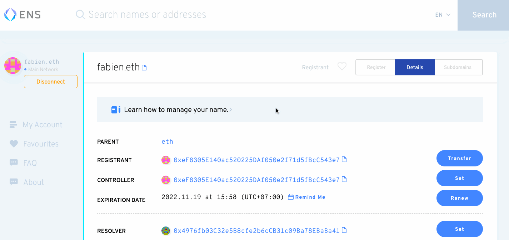

# How to Integrate PoE to Snapshot


Snapshot Setup Official Video


### 1. Get an ENS domain for your space

If you haven't already, follow this guide - [https://docs.snapshot.org/spaces/before-creating-your-space](https://docs.snapshot.org/spaces/before-creating-your-space) to get your ENS domain.&#x20;

### 2. Link your ENS domain to Snapshot

Once you have created your ENS domain, Go to this URL and modify the tag with your ENS domain. `https://snapshot.org/#/`**`<ENS DOMAIN>`**`/settings` and login with the wallet that owns the ENS domain.

Once connected, the **\<your-address>** tag will be replaced with your wallet address.


You will need a wallet that can sign message like MetaMask, Fortmatic, Portis, Argent. Don't use a Gnosis Safe has they are currently not supported.


If you are on your domain space and connected with your wallet you will see the correct **IPNS link** in the **ENS field**. Click on the button **Set record on ENS**, and you will get redirected to ENS page.

* On the ENS page, click on **ADD/EDIT RECORD**.
* Select **TEXT** and type the key **"snapshot"** in lowercase.
* Paste the **IPNS link** in the field.
* Click **Save**.
* Scroll down and click **Confirm**.
* Sign the transaction with your wallet.

### **3. Setup your space settings**

Refresh the Snapshot settings page `https://snapshot.org/#/`**`<ENS DOMAIN>`**`/settings` to see the space setting.

#### Profile

* **Name** is the name that will be displayed in your space.
* **About** is the description of your governance purposes.
* **Avatar** is your project logo.
* **Network** must be the network relative to your token. (PoE is currently available on ETH Mainnet, Rinkeby, Polygon (MATIC), and Polygon Mumbai Testnet.)

* **Symbol** is the main token symbol that will be displayed in your space.
* **Skin** can be left as a default, used as an existing one or you can [create your own skin](broken-reference).

* **Twitter** and **Github** just add a username to link to your different accounts.
* **Domain name** is optional but you can [add a custom domain](broken-reference).
* **Terms** links to your website's terms and conditions.
* **Hide space from homepage** if you want to keep your space "private".

#### **Strategies**

A strategy is a JavaScript function that defines how the voting power is calculated. You need to add a voting strategy for your proposals. erc20-balance-of is the strategy we will be using for PoE "One Voice, One Vote" integration.  You can have multiple strategies and can have your custom strategies as well, including a hybrid strategy of PoE + Token Balance/x to incorporate both holdings and individuality.&#x20;

You need to add a voting strategy for your proposals. `erc20-balance-of` is the strategy of choice for PoE.&#x20;


You can add up to 5 strategies in your space.


Once selected, you can edit the strategy by clicking on it and adding the following information:

1. Symbol: PoE
2. Address: \
   For ETH Mainnet the PoE Address is - 0x5945bAF9272e0808165aDea61b932eC1604FB161 \
   For Polygon the PoE Address is - 0x15A84E83e039a63a230ba786231dfB99544f7acB
3. Decimals: 1 - Since the token is not fractionalized the decimal point is not needed - default to 1.&#x20;

To learn more about different strategies for use: [https://docs.snapshot.org/strategies](https://docs.snapshot.org/strategies)

#### Admins

The admins will be able to edit the space settings and moderate proposals. You must add one address per line.

#### Members

Members will be able to create proposals without being constrained by filters. You must add one address per line. Generally keeping this blank is recommended so that logic is not confusing for users. If you want proposals to be generated by team members only be sure to demarcate those addresses here.

#### Filters

* **Proposal threshold** is the minimum number of tokens required to create a proposal, since we are working with a single token this should be set to 1.
* **Proposal validation** is a custom function to validate if someone can post a proposal or not. You can use the basic validation by default which takes your voting power with space strategies and checks if you pass a defined threshold. Others are available but the default is recommended.
* **Allow only members to submit a proposal** makes sure that only members specified in members field are allowed to submit a proposal.&#x20;

.png>)

#### Plugins

Plugins give extra features for your space. Explore plugins as needed, be sure to thoroughly understand what plugins DO before adding them and possibly breaking voting logic.&#x20;

### 4. Save your settings

Click "**Save**" then confirm the action in your wallet.

You are all set! You can go on `https://snapshot.org/#/<ENS_DOMAIN>` to see your space.
