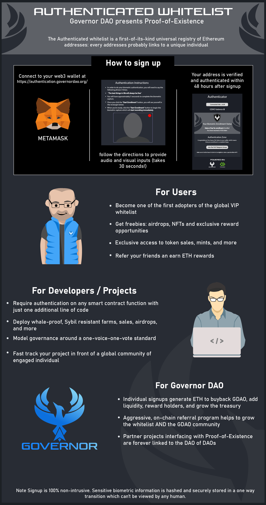

# POE Overview

### Introduction

[Proof-of-Existence](https://onevoiceonevote.governordao.org) is a first-of-its-kind innovation in sybil resistance, which addresses the decade-long dilemma of "how do I build decentralized systems designed for one account per user if I can't vet the accounts?"&#x20;

In other words, if you design your contract/emissions/token launch/consensus model around the notion that everyone gets one account, how do you stop people from using multiple accounts?

The original answer, pioneered by Bitcoin and Proof-of-Work, is to make weight-based systems: the more hashrate you provide, the more BTC you earn. This model is permissable in some instances (yet rarely optimal). Uncapped, performance-based POW has resulted in an increasingly energy inefficient, expensive consensus model.

In yield farms and governance voting, it means whales dominate the game and small accounts have virtually no say. In token sales and NFT mints, it means users are competing in gas wars against bots and multi-account participants.

The only widely use defense today against multi-account and bot abuse is KYC, which has a separate set of baggage. Proof-of-Existence is the first easy-to-integrate, non-intrusive, 100% effective, universal defense against sybil attacks.

### How it Works

Governor DAO, in partnership with leading biometrics firm Finnovant, have created a portal for biometric authentication of Ethereum wallets. Users enter the portal with a web3 connected wallet and input face + voice readings. Locally, the user device runs the input information through hundreds of algorithmic indicators to create an encrypted output hash representing the individual.

No two individuals produce the same output hash, and Governor DAO receives the hash that corresponds with the input address. If the hash is unique from all others in the system, the address is tokenized as "provably unique". A non-transferrable ERC20 "Proof of Existence" token is attached to the user wallet, which enables any smart contract to easily check for that verifiable uniqueness with just one additional line of code.

#### Security Notice: Governor DAO biometric signup is 100% anonymous and non-intrusive. Persons' biometric readings are hashed locally in the user device, and only the encrypted output is shared. No human ever sees face, voice readings.
