# POE Enroll User Guide

**Governor DAO Proof of Existence Portal**

**Quick Start Guide**

Version 1.2 Date: 05 April 2022

## This Guide will assist with:

1. Enroll (PoE token assignment)
2. Claim your free NFT on Mainnet
3. Join our “Humans Only” Telegram Group on Mainnet

**For more detailed info, check out the** [**Governor DAO Proof of Concept Guide.**](https://governordao.org/ProofOfConcept/GovernorDAO-PoC-UserGuide.pdf)

### PoE Portal URL's

1. **PoE Enrollment Portal on Mainnet** [https://OnlyOneMe.governordao.org](https://onlyoneme.governordao.org)

&#x20; **2. Mint a PoE token on Mainnet** [**https://passport.governordao.org**](https://humanchat.governordao.org)****

### Governor DAO Contract Addresses

**Ethereum Mainnet**

* GDAO Token Contract: 0x515d7e9d75e2b76db60f8a051cd890eba23286bc
* PoE Token Contract: 0x5945bAF9272e0808165aDea61b932eC1604FB161

****

## Instructions to Enroll

The following guide details instructions on how to participate in the Governor DAO enrollment process hosted on both '**Mainnet**' network via a PC or on mobile.

**IMPOTANT NOTE:**

The enrollment works on both PC and Mobile but there are known issues with MetaMask Mobile detailed in troubleshooting guide,

### Connect Wallet and Network

Connect ‘**Metamask**’ or ‘**WalletConnect**’

A warning will display if your wallet is connected to the wrong network.

* The 'Human Chat' Telegram chat has been migrated to Mainnet with a link appearing on the website once a PoE token has been minted on Mainnet

If this is your first time the “_**Status of VIP enrolment:**_” will be ‘**Unenrolled**’ or ‘_**Unknown**_’ (if the wallet isn’t connected).

### Start Enrollment

Once you’ve successfully connected your wallet you can now start the Enrollment process.

If you want to make sure your camera is lined up with your face, click **“Start Preview.”** The red dot will flash and you can position yourself so that your face lines up within the oval.

**Important NOTE:**

* If you appear frozen, i.e. your camera is not tracking your movement, there could be an issue with your webcam. Also, a common issue when using mobile phones (see note at the beginning of the section).
* Check Lighting conditions are suitable, if there are shadows or room is mixed light the capture may fail.
* Check Audio is clear.

Once you are ready, click ‘_**Start Enrollment**_’ to start the enrollment process.

_**NOTE – you will need to say the following phrase a total of 3 times, stating the phrase once per instance – "The best things in life will always be free"**_

Be sure to look at the camera and then you will have about 5 seconds to say the phrase each time.

After about 5 seconds the recording will stop and prompt you to ‘_**continue enrollment**_’ for a further 2 times.

While recording, a flashing red blinker will appear in the top right corner of the template.

After the 3rd recording a message will be displayed up to 60 later with one of the two messages.

\-    ‘_**Congratulations! You have successfully authenticated**_’

\-    "_**Unfortunately, your enrollment did not process completely.  Please try again:**_"

On success, the following heading will be updated ‘**Status of VIP enrollment**: _Enrolled_’

## PoE Token assignment

**NOTE: Once Say-Tec registration is complete, a PoE token can be minted from the following** [**page**](https://passport.governordao.org) **which will cost a small gas fee to complete the transaction. An automated process runs every 4 hours which collects new enrolments and authorizes the new wallet to mint a PoE token.**

Once the PoE token has been minted access to the Human Telegram group can be accessed from a link which is displayed on detection of the PoE token on [https://OnlyOneMe.governordao.org](https://onlyoneme.governordao.org) .

## Verifying enrollment later

Once your enrollment has been successful you can return at any time to use the PoC tech to verify your enrollment is functioning.

Whenever returning the PoC page the avatar will appear but instead of an option to ‘_**Start Enrollment**_’ a green ‘_**Start Validation**_’ button will appear instead.

To validate your registration only capture will be requested as well as video under the normal expected conditions.

* ‘_**Start Validation**_’ – States a wallet has been detected with biometrics registered.
* ‘_**Start Enrollment**_’ – States a wallet connected but no bio metrics registered, pending an enrollment.

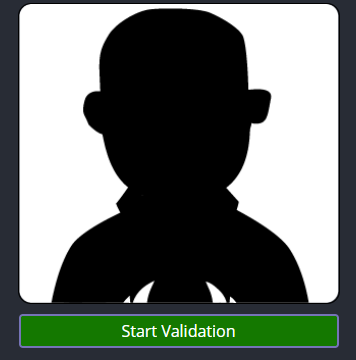 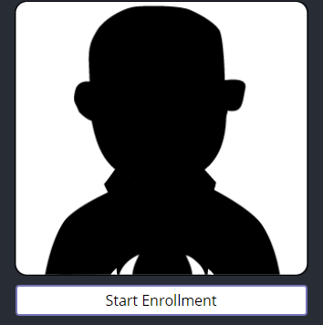

## Claiming your Free NFT on Mainnet

Pre-requisites to claim your free NFT:

* Successfully enroll and PoE token assigned
* Purchase or hold 50+ GDAO or xGDAO on Mainnet
* Claim your free NFT from the following website [URL](https://nft.governordao.org)

Confirm you’ve **successfully enrolled** and **a PoE token has been assigned** (completed the steps previously to Enroll).\

[https://nft.governordao.org](https://nft.governordao.org)

.png>) 50+ GDAO will be required to claim.

****

### **Join Human Telegram Group on Mainnet**

Once you have enrolled and minted your PoE token, you can join our GDAO “_**Humans Only**_” Telegram Group on Mainnet.

Note: You must use the link provided by the PoC webpage only (public link will not work!)

**The following link will only appear when you have received a PoE token at the bottom of the authentication** [<mark style="color:blue;">**page**</mark>](https://onlyoneme.governordao.org)**.**

Scroll down until you see the option “Join the PoE Telegram Group”

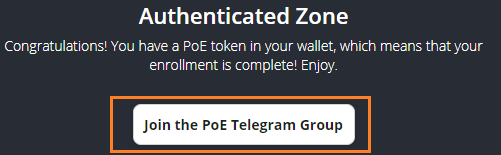

&#x20;Click ‘_**Join the PoE Telegram Group**_’

&#x20;When pasting link into a browser check option to open in telegram

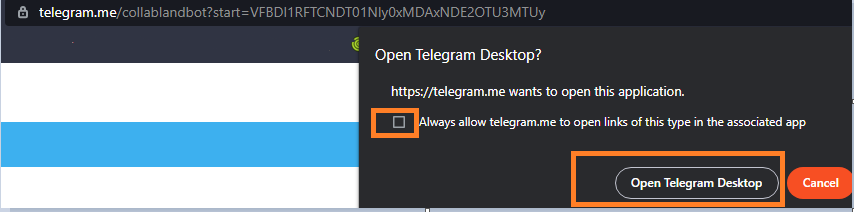

Interact with **Collab. Land** bot in Direct Message (for best results, use Telegram Desktop)

Click on ‘_**Connect**_’ and navigate to browser which has Metamask unlocked and connected on **Rinkeby**

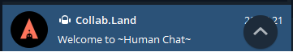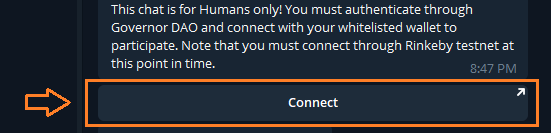

Follow the steps provided to link your Metamask wallet to **Collab.land**

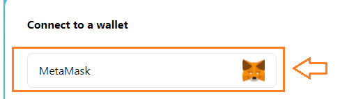_Connect Metamask_

You **MUST** connect with the same wallet you supplied for enrollment. Confirm wallet and ‘_**Connect**_’ and ‘_**Sign**_’

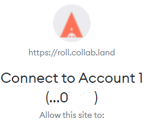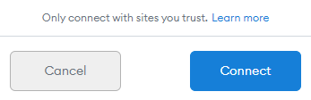__\
_Pop-up messages before sent to telegram_

After connection, if the wallet holds a POE token, you will be invited to ‘Join Group’ after presented with following message

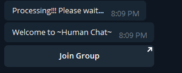

Click ‘_**Join Group**_’

If sign up fails (wrong address, no POE ownership, etc.) then restart the process by clicking on “_**Connect**_” command in the Bot messages. Further attempts to join the group (via “**join group**” command) will auto-deny access.

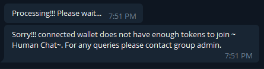

_Warning if no PoE token detected_

Unless for reasons stated as follows, the user has lifetime access to the group. Revocation of the token or discretion of admins can result in removal of the user from the group.

## Troubleshooting Guide

The following details issues which may be encountered during the PoC including enrollment.

1\.   Ensure there is suitable lighting when recording.

2\.   Ensure the browser has audio and camera record permissions which will pop up when clicking the ‘_**Start Enrollment**_’ button.

3\.   Successful recording will need to be a combination of both voice and video recording

4\.   Only one ‘_**VIP**_’ enrollment and one wallet can be registered, if a person attempts to register a 2nd wallet, they will experience an enrollment failure. The Say-Tec technology will detect that person's previous enrollment.

5\.   If any of the 3 recordings required to complete the enrollment differ in quality too much, for example on one the audio is picked up the enrollment will fail. The aim is to record 3 recordings staring into the camera and recording the same catch phrase consistently.

6\.   If issues are experienced during enrollment after the above conditions have been followed, we recommend reaching out to an admin. As Governor DAO is a consumer to the ‘Say-Tec’ technology the team can assist with confirming the details have been followed above but outside that the Finnovant support team will need to be engaged. In this case the following information would be required to provide coverage on the potential issues.

\-    ETH Wallet Address used as part of registration

\-    Which Browser, version

\-    What wallet Metamask / WalletConnect

\-    Date / Time of enrollment attempt including time zone

### Requesting support

If any issues are experienced with enrollment or website issues, there are several options to source assistance

* **Telegram Community chat**, request an admin in the following GovernorDao Chat [https://t.me/GovernorProject](https://t.me/GovernorProject)
* **GovernorDAO Discord** [https://discord.gg/MVh5NkN7gt](https://discord.gg/MVh5NkN7gt)
* **Governordao Blog WordPress server**, navigate to [https://blog.governordao.org/](https://blog.governordao.org)
* Click on message bubble at bottom right corner of screen

 _Live chat available_  _Chat offline_

* When green icon is lit a live agent is available, grey icon agent is offline
* If offline enter your name and email address and a description of the issue experienced and one of the team will contact you.
* **Log a support request through WordPress form**

**Click on the following URL to log a support from through to the team**

[https://blog.governordao.org/help-desk-form/](https://blog.governordao.org/help-desk-form/)

### Known Issues

#### Issue 1: Nested Camera disabled In MetaMask Mobile

Reported issue with MetaMask mobile, due to issues on nested camera access at the OS level Say-Tec software can’t be used in combination of Governor DAO PoC

#### Issue 2: NFT can’t be claimed on MetaMask Mobile

Once enrolled, the Say-tech enrollment can be accessed via Metamask Mobile but there is an issue with the ‘claim NFT’ button, please use the same device to claim the NFT where you enrolled.

#### Issue 3: Registering on Android through with Metamask via ‘wallet connect’ integration

Technically not an issue but a guide on using android and Brave browser. As the website has ‘wallet connect’ integration using browsers for example Brave and Metamask is workable and supported.

* First open Metamask, connect to ‘**Mainnet**’ network before opening browser.
* Open Brave and navigate to the URL, connect wallet and click on ‘_**start enrollment**_’
* A pop-up will appear to approve the use of your camera and mic
* A silhouette will appear with red flashing blinker, then the camera will become active, if the camera doesn’t activate Metamask may not be open.

#### Issue 4: Unable to join Telegram ‘Human Chat’

If the following message is displayed there is an issue a missing PoE token.

## Screenshots detailing different states of registration.

The following details the variations on connectivity and displays

### State 1: Wallet not connected,

\-    GDAO balance: null

\-    VIP enrollment: Unknown

\-    No PoE token detected

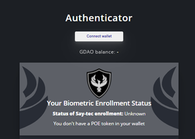

### State 2: Wallet Connected

\-    GDAO Balance displayed

\-    Say-Tec Status: Enrolled

\-    No PoE token detected

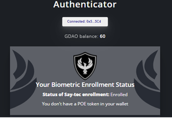

### State 3: Say-Tec Enrolled / PoE token

\-    GDAO Balance displayed

\-    VIP Status: Enrolled

\-    PoE token detected

\-    Authorised for PoE Telegram Group

\-    NFT Claim available

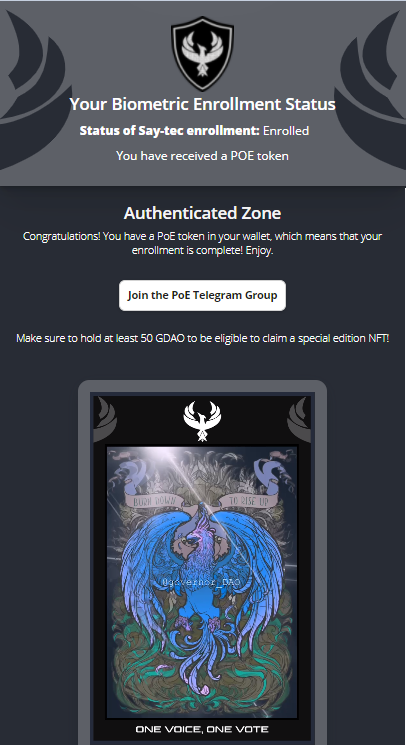

### State 4: Say-Tec Enrolled / PoE token / No GDAO

\-    GDAO Balance displayed as : 0

\-    VIP Status: Enrolled

\-    PoE token detected

\-    Authorised for PoE Telegram Group

\-    NFT Claim available (Not displayed unless 50 + GDAO)

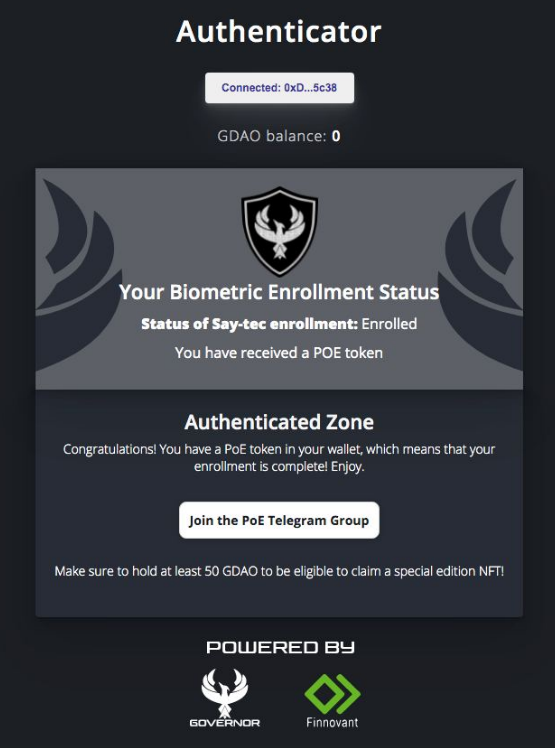
